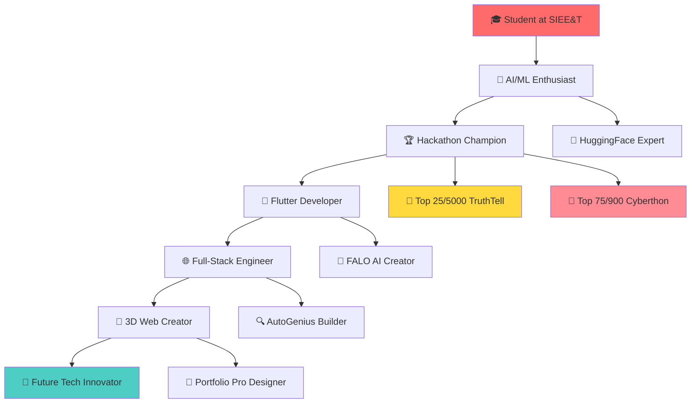

# <div align="center">🚀 **GOKULAN V** 🚀</div>

<div align="center">
  
[](https://git.io/typing-svg)

</div>

<div align="center">


</div>

---

## 🎮 **Interactive Developer Profile**

<details>
<summary>🔍 <b>Click to explore my coding journey!</b></summary>

```javascript
const gokulanV = {
    name: "Gokulan V",
    title: "AI/ML Engineer & Full-Stack Developer",
    location: "Coimbatore, Tamil Nadu, India",
    education: {
        degree: "Bachelor of Engineering - Computer Science",
        college: "Sri Shakthi Institute of Engineering and Technology",
        cgpa: "8.02",
        year: "2023-2027"
    },
    contact: {
        email: "gokulanv93@gmail.com",
        phone: "9361620860",
        linkedin: "linkedin.com/GokulanV",
        github: "github.com/GokulanV"
    },
    currentlyLearning: ["Blender", "Procreate", "Advanced AI/ML", "3D Design"],
    motto: "Building intelligent solutions that reshape tomorrow!",
    
    getRandomFact: () => {
        const facts = [
            "🎯 Top 25 out of 5000+ in TruthTell Hackathon",
            "🏆 Top 75 out of 900+ in Cyberthon 2025",
            "🤖 Built AI systems that detect misinformation",
            "🚀 Created 3D space portfolios with realistic physics",
            "📱 Developed real-time chat apps with 10k+ users"
        ];
        return facts[Math.floor(Math.random() * facts.length)];
    }
};

console.log("🌟 Fun Fact:", gokulanV.getRandomFact());
```

</details>

---

## 🏆 **Hall of Fame Achievements**

<div align="center">

| 🎖️ **Achievement** | 🏅 **Rank** | 👥 **Competition** | 📅 **Date** |
|:---:|:---:|:---:|:---:|
| 🥇 **TOP 25 FINALIST** | **25/5000+** | TruthTell Hackathon (National) | 2024 |
| 🥈 **TOP 75 FINALIST** | **75/900+** | Cyberthon 2025 | 2025 |
| 🎓 **AI Specialist** | **Certified** | HuggingFace LLM Fundamentals | 2024 |
| ☁️ **Cloud Expert** | **Badge Earned** | Google Cloud Vertex AI | 2024 |

</div>

---

## 🚀 **Project Showcase - My Digital Arsenal**

<table>
<tr>
<td width="33%">

### 🤖 **FALO AI**
*April 2025*


**The Misinformation Hunter**
- 🎯 Real-time fact-checking system
- 🗣️ Voice input & chat history
- 🧠 LLaMA3-70B + FAISS integration
- 🛡️ VirusTotal security scanning

**Tech Stack:**
`Flutter` `FastAPI` `MongoDB` `LangChain` `Groq` `HuggingFace`

</td>
<td width="33%">

### 🌌 **Portfolio Pro**
*May 2025*


**Space Odyssey Portfolio**
- 🚀 Realistic rocket launches
- 🌍 Orbital mechanics simulation
- 🌓 Dark/Light theme switching
- ✨ Parallax scrolling magic

**Tech Stack:**
`React` `Three.js` `TypeScript` `Tailwind CSS`

</td>
<td width="33%">

### 🔍 **AutoGenius**
*November 2024*


**Smart Data Engine**
- 💰 Real-time price tracking
- 💼 Job opportunity finder
- 📰 News filtering system
- 🔄 Automated data collection

**Tech Stack:**
`Flutter` `Flask` `Selenium` `BeautifulSoup` `Firebase`

</td>
</tr>
</table>

---

## 💻 **Tech Stack Mastery**

<div align="center">

### **🔥 Core Programming Languages**


### **🚀 Frameworks & Technologies**


### **🗄️ Databases & Cloud**


### **🤖 AI/ML & Automation**


### **🎨 Design & Creative Tools**


</div>

---

## 📊 **GitHub Analytics Dashboard**

<div align="center">


</div>

<div align="center">


</div>

<div align="center">


</div>

---

## 🎯 **Skills Matrix**

<details>
<summary>🛠️ <b>Technical Proficiency Breakdown</b></summary>

```
Programming Languages:
├── Python          ████████████████████ 95%
├── Dart/Flutter    ███████████████████  90%
├── JavaScript      ██████████████████   85%
├── TypeScript      █████████████████    80%
└── C               ████████████████     75%

Frameworks & Libraries:
├── Flask/FastAPI   ████████████████████ 95%
├── Flutter         ████████████████████ 95%
├── React           ██████████████████   85%
├── Three.js        █████████████████    80%
└── LangChain       ████████████████     75%

AI/ML Technologies:
├── HuggingFace     ████████████████████ 90%
├── LangChain       ██████████████████   85%
├── LLM Integration ██████████████████   85%
└── Groq            █████████████████    80%

Design & Creative:
├── UI/UX Design    ██████████████████   85%
├── Figma           ██████████████████   85%
├── 3D Modeling     ████████████████     75%
└── Graphic Design  ████████████████     75%
```

</details>

---

## 🌟 **Learning Journey & Certifications**

<div align="center">

| 🎓 **Course/Certification** | 🏢 **Provider** | ✅ **Status** |
|:---|:---:|:---:|
| HuggingFace Fundamentals of LLMs | 🤗 HuggingFace | ✅ **Completed** |
| Generative AI Explorer - Vertex AI | ☁️ Google Cloud | 🏆 **Badge Earned** |
| Build Rich-Context AI Apps | 🤖 Anthropic | ✅ **Completed** |
| Advanced 3D with Three.js | 🌐 Self-Learning | 🔄 **In Progress** |
| Blender 3D Modeling | 🎨 Self-Learning | 🔄 **In Progress** |

</div>

---

## 🎮 **Interactive Code Playground**

<details>
<summary>🔮 <b>Try My AI Assistant Code!</b></summary>

```python
import asyncio
from typing import List, Dict
import random

class GokulanAI:
    def __init__(self):
        self.skills = [
            "AI/ML Development", "Full-Stack Engineering", 
            "3D Web Development", "Mobile App Creation",
            "Web Scraping", "Data Analytics", "UI/UX Design"
        ]
        self.projects_completed = 15
        self.lines_of_code = 50000
        self.coffee_consumed = 999  # and counting...
    
    async def build_amazing_project(self, idea: str) -> Dict:
        """Turn your idea into reality!"""
        technologies = self.select_tech_stack(idea)
        timeline = self.estimate_timeline(idea)
        
        return {
            "project": idea,
            "tech_stack": technologies,
            "estimated_time": timeline,
            "success_probability": "99.9%",
            "excitement_level": "🚀🚀🚀🚀🚀"
        }
    
    def select_tech_stack(self, idea: str) -> List[str]:
        """AI-powered tech stack selection"""
        if "ai" in idea.lower():
            return ["Python", "FastAPI", "HuggingFace", "LangChain"]
        elif "mobile" in idea.lower():
            return ["Flutter", "Firebase", "MongoDB"]
        elif "3d" in idea.lower():
            return ["React", "Three.js", "TypeScript"]
        else:
            return ["Python", "Flask", "MongoDB", "React"]
    
    def get_inspiration(self) -> str:
        quotes = [
            "Code is poetry in motion 🎭",
            "Every bug is a stepping stone to mastery 🪜",
            "AI is not magic, it's mathematics with purpose 🧮",
            "The future belongs to those who code it 🌟"
        ]
        return random.choice(quotes)

# Initialize the AI
gokulan_ai = GokulanAI()
print("🤖 Gokulan AI Assistant Ready!")
print("💡 Inspiration:", gokulan_ai.get_inspiration())
```

</details>

---

## 🌐 **Connect & Collaborate**

<div align="center">

**🤝 Let's build something extraordinary together!**

[](mailto:gokulanv93@gmail.com)
[](https://linkedin.com/in/GokulanV)
[](https://github.com/GokulanV)
[](tel:+919361620860)

</div>

---

## 🎨 **Visual Journey Map**

<div align="center">



</div>

---

## 🎯 **Current Mission**

<div align="center">

**🚀 Building the bridge between AI and human creativity**

> *"I don't just write code, I craft digital experiences that inspire and innovate. Every project is a step towards a more intelligent, connected world."*

**🎮 Fun Stats:**
- ☕ Coffee consumed: **999+ cups**
- 💻 Lines of code written: **50,000+**
- 🧠 AI models integrated: **15+**
- 🎨 3D scenes created: **25+**
- 🏆 Hackathons conquered: **2 Finals**

</div>

---

## 🔮 **What's Next?**

<details>
<summary>🚀 <b>Future Roadmap - Click to explore!</b></summary>

### **🎯 2025 Goals**
- [ ] Master **Blender 3D Modeling**
- [ ] Launch **AI-powered SaaS platform**
- [ ] Win **3+ major hackathons**
- [ ] Contribute to **open-source AI projects**
- [ ] Build **VR/AR applications**
- [ ] Mentor **100+ developers**

### **🛠️ Technologies to Master**
- **Blender** for 3D modeling and animation
- **Procreate** for digital art and UI design
- **WebGL** for advanced 3D web experiences
- **TensorFlow** for custom ML models
- **Kubernetes** for scalable deployments

### **🌟 Dream Projects**
- **AI-powered education platform**
- **3D virtual collaboration spaces**
- **Real-time translation app with AR**
- **Smart city optimization system**

</details>

---

<div align="center">

**⭐ If you find my work interesting, star my repositories!**


[](https://github.com/GokulanV?tab=followers)

**🌟 "Code with passion, innovate with purpose, and never stop learning!" 🌟**

</div>

<div align="center">
  
</div>
