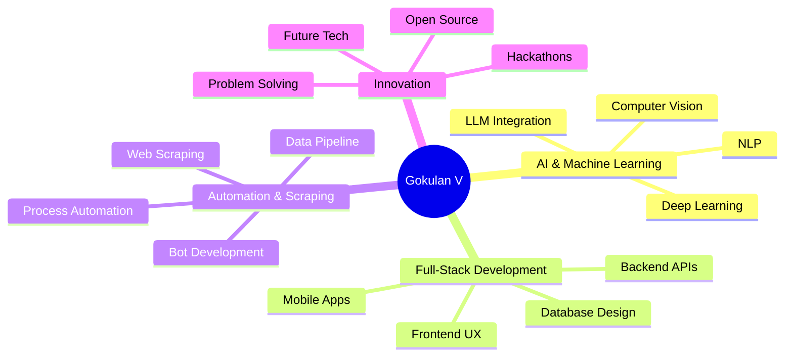

#  Hi there, I'm **Gokulan V** 

<div align="center">
  
  
  
</div>

---

## 🚀 **About Me**

```python
class GokulanV:
    def __init__(self):
        self.name = "Gokulan V"
        self.role = "Software Developer & Tech Innovator"
        self.current_focus = ["Machine Learning", "AI Agent Development", "Real-time Systems"]
        self.languages = ["Python", "Dart", "JavaScript", "SQL"]
        self.frameworks = ["Flask", "Flutter", "React"]
        self.databases = ["MongoDB", "PostgreSQL", "Firebase"]
        self.passion = "Creating intelligent solutions that make a difference"
    
    def get_daily_activities(self):
        return [
            "🔬 Experimenting with AI/ML algorithms",
            "🤖 Building smart MCP Agents",
            "📱 Developing cross-platform applications",
            "🌐 Web scraping & automation",
            "📚 Learning cutting-edge technologies"
        ]
```

---

## 🎯 **Current Projects & Focus**

<table>
<tr>
<td width="50%">

### 🤖 **MCP Agents Development**
- **Natural language-driven agents** powered by **Groq LLM**
- Real-time product data manipulation
- Intelligent automation systems
- Advanced prompt engineering

</td>
<td width="50%">

### 🚀 **AutoGenius Platform**
- Real-time data aggregation engine
- Smart job-finding algorithms
- Intelligent news filtering system
- Scalable microservices architecture

</td>
</tr>
</table>

---

## 🏆 **Achievements & Recognition**

<div align="center">

| 🏅 **Achievement** | 🎯 **Details** |
|:------------------:|:-------------:|
| **TruthTell Hackathon** | 🥇 **Top 25** out of **5000+ teams** |
| **Cyberthon** | 🏆 **Finalist** |
| **Smart India Hackathon** | 🎯 **Participant** |

</div>

---

## 🛠️ **Tech Arsenal**

<div align="center">

### **Languages**


### **Frameworks & Libraries**


### **Databases & Cloud**


### **AI/ML & Tools**


</div>

---

## 📊 **GitHub Analytics**

<div align="center">
  


</div>

<div align="center">
  
[](https://git.io/streak-stats)

</div>

---

## 🎨 **What I'm Passionate About**

<div align="center">



</div>

---

## 🌟 **Let's Connect & Collaborate**

<div align="center">

**Ready to build something amazing together?**

[](mailto:gokulanv93@gmail.com)
[](https://linkedin.com/in/your-profile)
[](https://github.com/PolarBearGG)
[](https://twitter.com/your-profile)

</div>

---

## 💭 **Fun Fact**

> *"I believe the best code is not just functional, but elegant – like poetry that machines can understand and humans can admire."*

<div align="center">

**⭐ Star my repositories if you find them interesting!**


</div>

---

<div align="center">
  
</div>
